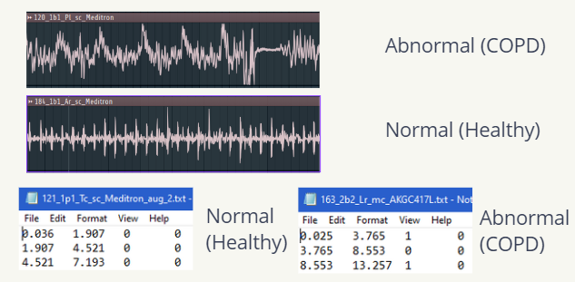

# GFCC to RNN Prediction



This project demonstrates the process of extracting Gammatone Frequency Cepstral Coefficients (GFCC) from audio files and using them as input features for a Recurrent Neural Network (RNN) to predict patient conditions.

Presentation for this project can be found [here](https://www.canva.com/design/DAFy_wW4h9c/MUiO0YgN-r88MK8hvSUE-Q/edit?utm_content=DAFy_wW4h9c&utm_campaign=designshare&utm_medium=link2&utm_source=sharebutton).


## Overview

1. **GFCC Extraction**: GFCCs are extracted from audio files. These coefficients are similar to MFCCs but are based on the Gammatone filter bank, which is designed to mimic the human auditory system.
2. **Data Preparation**: The extracted GFCCs are structured and labeled according to the patient's condition.
3. **RNN Model**: An RNN model, specifically using LSTM layers, is trained on the GFCC features to predict the patient's condition.

## Steps

### 1. GFCC Extraction

The process of extracting Gammatone Frequency Cepstral Coefficients (GFCC) from audio files involves several steps. The main goal is to transform the audio signal into a representation that captures the characteristics of the sound in a way that's similar to how the human auditory system perceives it.

- **Pre-emphasis**: Before extracting the GFCCs, the audio signal undergoes a pre-emphasis step to amplify the high frequencies. This is done to balance the frequency spectrum since high frequencies usually have lower magnitudes compared to lower frequencies.

- **Framing**: The continuous audio signal is divided into short frames. This is based on the assumption that the frequencies in an audio signal are stationary over a short period of time.

- **Windowing**: Each frame is then windowed using a Hamming window to minimize the edge effects.

- **Fourier Transform and Power Spectrum**: A Fourier Transform is applied to each frame to convert it from the time domain to the frequency domain. The magnitude of the result is then squared to get the power spectrum.

- **Gammatone Filter Bank**: 
  - The human auditory system processes different frequencies selectively. To mimic this behavior, a filter bank based on the Gammatone function is used. The Gammatone filter bank divides the frequency spectrum into overlapping bands that are spaced approximately according to the human ear's critical bandwidths.
  - The function `make_gammatone_filterbank` creates this filter bank. It uses the `gammatone_filter` function, which generates individual gammatone filters for specified center frequencies.
  - The `erb_bandwidth` function calculates the Equivalent Rectangular Bandwidth (ERB) for a given frequency, which is used in the design of the gammatone filters.

- **GFCC Calculation**: 
  - Once the power spectrum is obtained, it is passed through the Gammatone filter bank using matrix multiplication. This results in the energy levels in each of the filter bands.
  - These energy levels are then log-transformed to mimic the logarithmic perception of loudness and pitch by the human auditory system.
  - Finally, a Discrete Cosine Transform (DCT) is applied to these log energies to obtain the GFCCs. The DCT has the property of decorrelating the filter bank coefficients, which results in a compressed representation of the filter bank energies. This is analogous to the Mel Frequency Cepstral Coefficients (MFCC) extraction process, but with a filter bank that's designed to mimic the human auditory system more closely.

### 2. Data Preparation

The process of preparing the data involves converting raw audio files into a structured format suitable for training a machine learning model. This involves several steps:

- **CSV Data Loading**: 
  - At the beginning of the code, the `csv_file_path` specifies the path to the CSV file that contains the diagnosis for each patient.
  - The `diagnosis` dictionary is populated using the `csv.reader` function. This dictionary maps patient numbers to their respective diagnoses. For example, `{101: 'URTI', 102: 'Healthy', ...}`.

- **Labeling**: 
  - Each audio file in the dataset is named in a way that the patient number can be extracted from its filename. This is done using the line `patient_num = int(audio_file.split('_')[0])`.
  - Once the patient number is extracted, the diagnosis for that patient is looked up in the `diagnosis` dictionary.
  - The diagnosis is then mapped to a numerical label using the `condition_to_label` dictionary. This dictionary is created based on the unique conditions provided in the `unique_conditions` list. For example, 'COPD' might be mapped to `0`, 'LRTI' to `1`, and so on.
  - If a condition is not found in the `unique_conditions` list, it's assigned a default label, which is the next number after the last label in the list.

- **Feature Structuring**: 
  - The GFCCs extracted from each audio file are stored in the `gfcc_features` dictionary, where the key is the filename of the audio file and the value is the GFCC matrix for that file.
  - Since the audio files can have different lengths, the GFCC matrices can have different numbers of rows (frames). To handle this variability, the `pad_sequences` function is used. This function pads the GFCC matrices with zeros so that they all have the same number of rows. This ensures that the input to the RNN has a consistent shape.
  - The `gfcc_features` dictionary is then converted into two arrays: `X` and `y`. The `X` array contains the padded GFCC matrices, and the `y` array contains the corresponding labels. These arrays are used as the input features and target labels, respectively, for training the RNN.

- **Data Saving**: 
  - The `save_to_csv` function is used to save the prepared data to CSV files. This includes the GFCC features (`X`), the labels (`y`), and the original GFCC features with filenames (`gfcc_features`).
  - This step ensures that the extracted features and labels are stored in a persistent format, making it easier to load and use them in future sessions without having to re-run the entire extraction process.

### 3. RNN Model

- **Model Architecture**: The RNN model uses LSTM layers, which are a type of RNN layer suitable for sequence data like audio. Dropout layers are added for regularization to prevent overfitting.
- **Training**: The model is trained on a subset of the data (training set) and validated on another subset (validation/test set).
- **Prediction**: Once trained, the model can predict the condition of a patient based on the GFCCs extracted from their audio file.

## Usage

1. **Dependencies**:
    ```bash
    pip install numpy pandas sklearn tensorflow
    ```

2. **Run the GFCC extraction script** to obtain the GFCC features and labels from the audio files.

3. **Split the data** into training and test/validation sets.

4. **Train the RNN model** on the training data.

5. **Evaluate** the model's performance on the test/validation data.

6. **Predict**: Use the trained model to make predictions on new audio data.

## Conclusion

This project showcases the potential of using audio signal processing techniques combined with deep learning to predict medical conditions. The use of GFCCs provides a robust representation of the audio signal, and the RNN model can capture the sequential patterns in the data for accurate predictions.
